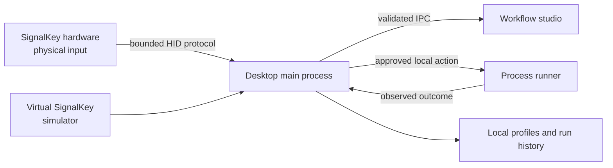

# SignalKey

[](docs/READINESS-INTEGRATION.md)
[](docs/WINDOWS-INSTALLATION.md)
[](package.json)
[](LICENSE-STATUS.md)
[](manufacturing/MANUFACTURER-PARTNERSHIP-NOTE.md)

**A local-first desktop workflow controller with a tactile hardware direction.** SignalKey lets a person press a physical control, run an explicitly approved local workflow, and inspect its observed result. The desktop companion is at `0.1.0-alpha.2`; the physical product is an engineering concept under development.


> **TILE T1 is an engineering partnership handoff, not a production release.** SignalKey supplies design intent, prototype-oriented CAD and evidence. A manufacturing partner must complete DFM/DFA, production CAD, sourcing, tooling, fixtures, qualification and release work under a separate written agreement.

## At a glance

| Area | Current state |
| --- | --- |
| Desktop companion | Functional local Electron application; profiles, gestures, run history and guarded workflow execution persist locally. |
| Workflow safety | New or changed execution details require native review. Interrupted actions are recorded and never retried automatically. |
| Hardware connection | Simulator and protocol boundary are tested; physical device integration is still unverified. |
| Enclosure | TILE T1 is the active larger enclosure proposal, with editable CAD, prototype meshes and illustrated documentation. |
| Manufacturing | Partnership-development material only. No released tooling, production PCB, first article or factory qualification exists. |

## Start here

| You want to… | Read or run |
| --- | --- |
| Try the desktop companion | [Run locally](#run-locally) |
| Review the complete readiness evidence | [Integration readiness report](docs/READINESS-INTEGRATION.md) |
| Browse the documentation by current status | [Documentation index](docs/README.md) |
| Review the active physical design | [TILE T1 enclosure package](mechanical/tile-t1/README.md) |
| Evaluate a manufacturing partnership | [Manufacturer partnership note](manufacturing/MANUFACTURER-PARTNERSHIP-NOTE.md) |
| Prepare this repository for GitHub | [Publication checklist](docs/GITHUB-PUBLICATION.md) |
| Understand security boundaries | [Security policy](SECURITY.md) |

## What works today

The desktop companion is local-first: it stores profiles and history on the local machine, has no account or cloud requirement, and executes only explicitly configured local commands. The workflow studio supports profile creation, gesture mapping, guarded action enablement, observed process results, cancellation, persistent run history and a virtual SignalKey simulator.

The repository includes a reproducible Windows package check and automated coverage for process lifecycle, duplicate admission, cancellation, interrupted-run recovery, configuration persistence, protocol bounds and desktop behavior. The current evidence distinguishes simulator results from physical-device results; it never treats simulated connection behavior as hardware validation.

## TILE T1 physical direction

TILE T1 translates the selected rounded-square desktop-control appearance into a larger serviceable package for the current P3 bench stack. Its **128 × 108 × 52 mm** study envelope accommodates the documented arcade switch, Pico/breadboard prototype, LED ring, wiring and rear Micro-USB access without claiming that a smaller concept enclosure can fit them.

The active package includes:

- [Editable parametric model](mechanical/tile-t1/tile-t1.scad)
- [Assembly, drawings and prototype instructions](mechanical/tile-t1/README.md)
- [Dimensioned drawing](mechanical/tile-t1/exports/T1-dimensioned-drawing.svg), [exploded assembly](mechanical/tile-t1/exports/T1-exploded-assembly.svg) and [section reference](mechanical/tile-t1/exports/T1-section-annotations.svg)
- Printable STL and 3MF prototype exports, clearance coupons, a part BOM and a blank physical inspection record
- Separate [prototype and production route](mechanical/tile-t1/PROTOTYPE-AND-PRODUCTION.md)

The outputs have passed digital mesh/export checks. They have **not** passed print-and-fit, connector, harness, optical, tactile, durability, moldability, electrical or production validation. STEP is intentionally absent because a B-rep CAD exporter is not installed; see [STEP export status](mechanical/tile-t1/STEP-EXPORT-BLOCKED.md).

## Run locally

SignalKey targets Windows and uses Node.js 24.

```powershell
npm ci
npm run build
npm start
```

Select **Virtual SignalKey (simulator)** and run **Sample · passing tests** to exercise the workflow loop without hardware. The command runs a harmless local sample process and shows its observed result in Activity.

For development and verification:

```powershell
npm run typecheck
npm test
npm run build
npm run test:desktop
```

See the [Windows installation and recovery guide](docs/WINDOWS-INSTALLATION.md) for portable-package, upgrade, recovery and unsigned-build details.

## Architecture



The renderer does not receive unrestricted shell access. The main process validates IPC and workflow configuration; the runner uses an executable and argument array rather than implicit shell interpolation. Read [SECURITY.md](SECURITY.md) before configuring workflows.

## Manufacturing partnership

SignalKey is seeking the right manufacturing-development partner to turn the T1 direction into a buildable product. The repository helps a prospective partner assess the design intent and identify the remaining work; it does not authorize fabrication, procurement, tooling or commercial production.

The partner scope includes received-part measurement, DFM/DFA, controlled B-rep CAD, toleranced drawings, supplier qualification, tooling, test fixtures, first articles, reliability/optical/electrical validation, quality controls and the appropriate compliance route. Details are in the [manufacturer partnership note](manufacturing/MANUFACTURER-PARTNERSHIP-NOTE.md).

## Engineering status and limitations

The desktop is alpha software. The CAD is a virtual engineering study. No physical SignalKey unit, harness, printed enclosure, production PCB, mold, robot cell or factory test fixture has been qualified. The amber prototype optical insert may affect RGB status presentation, and real-device measurements are required before a product decision.

Read the [readiness report](docs/READINESS-INTEGRATION.md) for requirement-level evidence and the prioritized physical/integration risks.

## Repository map

| Path | Contents |
| --- | --- |
| `apps/desktop` | Electron main process, workflow runner and UI |
| `packages/protocol` | Framed device protocol and tests |
| `packages/sdk`, `packages/cli` | Local SDK and command-line client |
| `firmware` | RP2040 source and reproducible build evidence; not a released device binary |
| `hardware` | P3 wiring information and custom-PCB review gaps |
| `mechanical/tile-t1` | Active enclosure concept, CAD, exports, drawings and validation record |
| `manufacturing` | Partnership, industrial-route and release-readiness material |
| `docs` | Architecture, installation, evidence, risk and publication documentation |

## Ownership, contact and use

SignalKey is a Magnexis project, created by **Matthew Looney** ([`@theworker02`](https://github.com/theworker02)).

Copyright © 2026 Magnexis. All rights reserved. No open-source license is currently granted; see [LICENSE-STATUS.md](LICENSE-STATUS.md). Prospective manufacturers may review the material under the [manufacturer partnership note](manufacturing/MANUFACTURER-PARTNERSHIP-NOTE.md). Do not manufacture, quote, tool, procure or distribute this work without a separate written agreement and production release.

## Contributing and security

See [CONTRIBUTING.md](CONTRIBUTING.md) for development standards and [SECURITY.md](SECURITY.md) for vulnerability reporting and security boundaries. Do not submit credentials, personal profiles, guessed fabrication files or unreviewed hardware claims.
