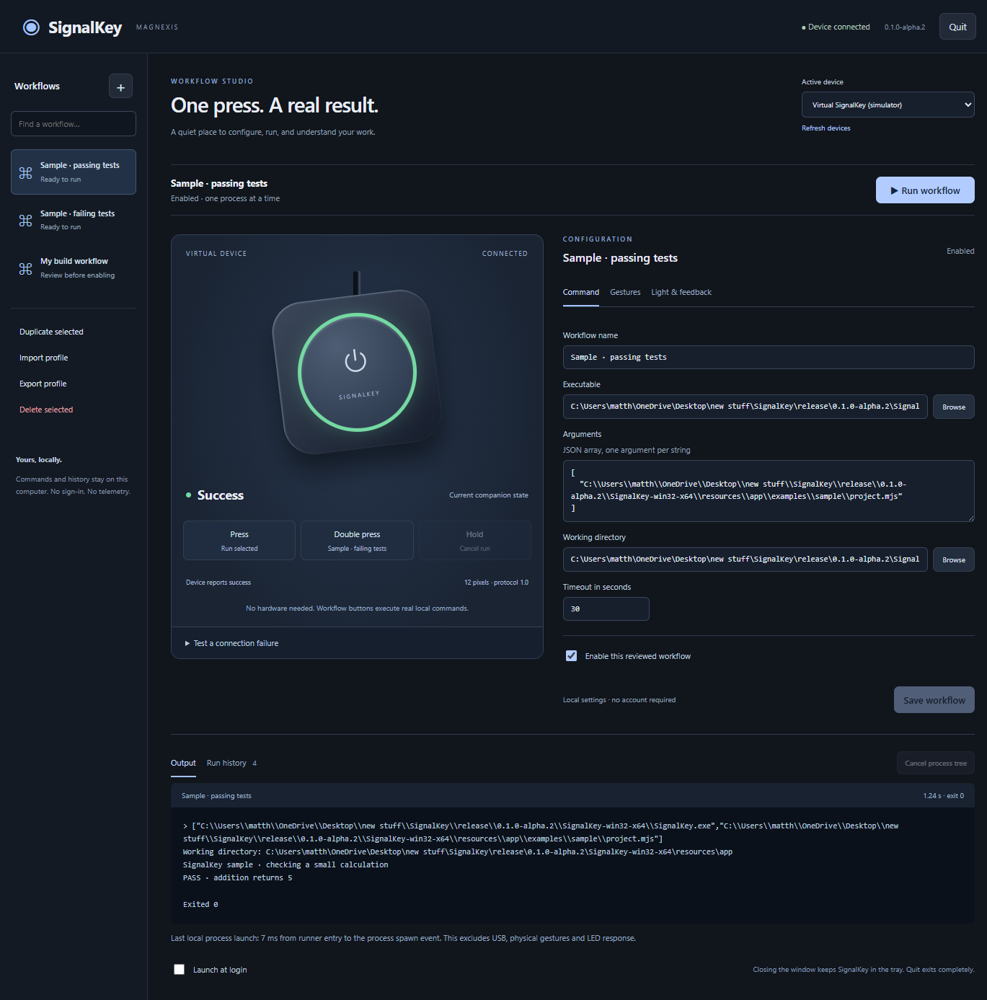
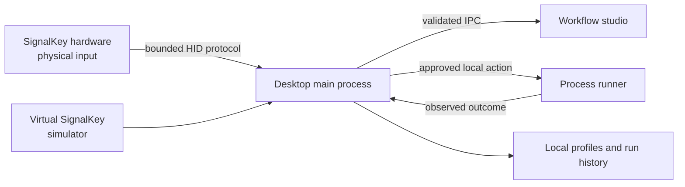

# SignalKey

[](docs/READINESS-INTEGRATION.md)
[](docs/WINDOWS-INSTALLATION.md)
[](package.json)
[](LICENSE-STATUS.md)
[](manufacturing/MANUFACTURER-PARTNERSHIP-NOTE.md)

**A local-first desktop workflow controller with a tactile hardware direction.** SignalKey lets a person press a physical control, run an explicitly approved local workflow, and inspect its observed result. The desktop companion is at `0.1.0-alpha.2`; the physical product is an engineering concept under development.



> **TILE T1 is an engineering partnership handoff, not a production release.** SignalKey supplies design intent, prototype-oriented CAD and evidence. A manufacturing partner must complete DFM/DFA, production CAD, sourcing, tooling, fixtures, qualification and release work under a separate written agreement.

## At a glance

| Area | Current state |
| --- | --- |
| Desktop companion | Functional local Electron application; profiles, gestures, run history and guarded workflow execution persist locally. |
| Workflow safety | New or changed execution details require native review. Interrupted actions are recorded and never retried automatically. |
| Hardware connection | Simulator and protocol boundary are tested; physical device integration is still unverified. |
| Enclosure | TILE T1 is the active larger enclosure proposal, with editable CAD, prototype meshes and illustrated documentation. |
| Manufacturing | Partnership-development material only. No released tooling, production PCB, first article or factory qualification exists. |

## Start here

| You want to… | Read or run |
| --- | --- |
| Try the desktop companion | [Run locally](#run-locally) |
| Review the complete readiness evidence | [Integration readiness report](docs/READINESS-INTEGRATION.md) |
| Browse the documentation by current status | [Documentation index](docs/README.md) |
| Review the active physical design | [TILE T1 enclosure package](mechanical/tile-t1/README.md) |
| Evaluate a manufacturing partnership | [Manufacturer partnership note](manufacturing/MANUFACTURER-PARTNERSHIP-NOTE.md) |
| Prepare this repository for GitHub | [Publication checklist](docs/GITHUB-PUBLICATION.md) |
| Understand security boundaries | [Security policy](SECURITY.md) |

## What works today

The desktop companion is local-first: it stores profiles and history on the local machine, has no account or cloud requirement, and executes only explicitly configured local commands. The workflow studio supports profile creation, gesture mapping, guarded action enablement, observed process results, cancellation, persistent run history and a virtual SignalKey simulator.

The repository includes a reproducible Windows package check and automated coverage for process lifecycle, duplicate admission, cancellation, interrupted-run recovery, configuration persistence, protocol bounds and desktop behavior. The current evidence distinguishes simulator results from physical-device results; it never treats simulated connection behavior as hardware validation.

### A typical workflow

1. Create or select a profile for a context such as a project, build, test suite or local tool.
2. Configure a workflow with an executable, argument array, absolute working directory and timeout.
3. Assign the workflow to single press, double press or hold; assign cancel or no action where appropriate.
4. Review and explicitly enable the action. Imports and changed execution details do not become runnable silently.
5. Trigger the gesture from the simulator or an approved device. SignalKey records the observed process result and bounded output.
6. Inspect Activity and history. If the application was interrupted mid-run, SignalKey records an unknown/interrupted outcome and requires a deliberate human decision before another run.

### Persistence, recovery and duplicate behavior

Profiles, gesture assignments, selected profile and history are stored in Electron's local user-data area. An in-flight action receives a durable intent record before the process launches; its final history record is written before that intent is removed. If the app exits unexpectedly, recovery marks the unresolved action interrupted. SignalKey does not automatically replay it because arbitrary commands may have caused an external effect before the interruption.

Concurrent identical presses are admitted once per active run. A later deliberate press after completion is a new action; the product does not represent this transport-level safeguard as permanent business-operation idempotency. See the [integration readiness report](docs/READINESS-INTEGRATION.md) for the exact tested boundaries.

### Connection model

The companion can use **Virtual SignalKey** for software evaluation, or a bounded vendor-defined HID protocol for a future physical device. The host handshakes, checks capabilities, uses acknowledgements and expires stale device state. Disconnecting a status device does not undo an already-launched local command, and reconnecting never replays that command.

The physical HID behavior is still an unverified integration target. Read [hardware integration evidence](docs/HARDWARE-INTEGRATION.md) before interpreting protocol tests as a device qualification.

## TILE T1 physical direction

TILE T1 translates the selected rounded-square desktop-control appearance into a larger serviceable package for the current P3 bench stack. Its **128 × 108 × 52 mm** study envelope accommodates the documented arcade switch, Pico/breadboard prototype, LED ring, wiring and rear Micro-USB access without claiming that a smaller concept enclosure can fit them.

The active package includes:

- [Editable parametric model](mechanical/tile-t1/tile-t1.scad)
- [Assembly, drawings and prototype instructions](mechanical/tile-t1/README.md)
- [Dimensioned drawing](mechanical/tile-t1/exports/T1-dimensioned-drawing.svg), [exploded assembly](mechanical/tile-t1/exports/T1-exploded-assembly.svg) and [section reference](mechanical/tile-t1/exports/T1-section-annotations.svg)
- Printable STL and 3MF prototype exports, clearance coupons, a part BOM and a blank physical inspection record
- Separate [prototype and production route](mechanical/tile-t1/PROTOTYPE-AND-PRODUCTION.md)

The outputs have passed digital mesh/export checks. They have **not** passed print-and-fit, connector, harness, optical, tactile, durability, moldability, electrical or production validation. STEP is intentionally absent because a B-rep CAD exporter is not installed; see [STEP export status](mechanical/tile-t1/STEP-EXPORT-BLOCKED.md).

### Mechanical intent

The large cap is guided at four distributed points rather than balanced on a single switch. Its center plunger engages the current arcade-button envelope, while guide/load posts are intended to carry normal overtravel into the chassis instead of loading a PCB. The graphite lower chassis holds the service seam, underside fasteners and feet; the white upper housing retains the clean desktop-facing surfaces. These are design-intent features that need measurement against the received switch and physical corner-press testing.

The narrow upper-right light feature uses the existing LED-ring envelope as an internal source. An amber prototype insert is visually aligned with the selected concept, but a tinted guide can affect RGB status readability. The production optical material remains a partner validation decision; see the [T1 prototype and production route](mechanical/tile-t1/PROTOTYPE-AND-PRODUCTION.md).

## Releases and downloadable material

The current pre-release is [v0.1.0-alpha.2 — TILE T1 engineering handoff](https://github.com/theworker02/signalkey/releases/tag/v0.1.0-alpha.2).

| Asset | Intended use | Important boundary |
| --- | --- | --- |
| T1 review kit | CAD, drawings, BOM, fit record and partner review | Review/fit-prototype material; not manufacturing release data. |
| Windows portable package | Evaluate the alpha desktop companion on Windows | Unsigned portable package; keep its extracted directory together. |
| Source archive | Inspect and reproduce source-controlled material | Requires Node 24 and documented local tools; it does not include local toolchains or release binaries. |

Each release asset has a SHA-256 record where supplied. Hashes establish file integrity only; they are not a software signature, security certification or production approval.

## Run locally

SignalKey targets Windows and uses Node.js 24.

```powershell
npm ci
npm run build
npm start
```

Select **Virtual SignalKey (simulator)** and run **Sample · passing tests** to exercise the workflow loop without hardware. The command runs a harmless local sample process and shows its observed result in Activity.

For development and verification:

```powershell
npm run typecheck
npm test
npm run build
npm run test:desktop
```

See the [Windows installation and recovery guide](docs/WINDOWS-INSTALLATION.md) for portable-package, upgrade, recovery and unsigned-build details.

### Configuration and local data

The normal user-data location is `%APPDATA%\SignalKey`. It contains local profile configuration, recent run history, in-flight recovery state and an ephemeral local SDK token. Treat the directory as private: command paths, arguments and output may reveal sensitive project information. Do not commit or share user-data files, especially `sdk.json`.

The application does not add cloud synchronization, telemetry or account requirements. Moving to another package location can preserve the same user data, while a separate `--user-data-dir` is useful for isolated testing.

### Local CLI and SDK

With the desktop companion running, the repository exposes a local CLI and TypeScript SDK for status and workflow interactions:

```powershell
npm run cli -- devices
npm run cli -- status
npm run cli -- run sample-pass
npm run cli -- light success
npm run demo:sdk
```

The local SDK binds only to loopback and uses a session-scoped token. SDK `run` acceptance is not process completion; inspect status/history for the observed result. The SDK cannot create or enable workflows.

## Architecture



The renderer does not receive unrestricted shell access. The main process validates IPC and workflow configuration; the runner uses an executable and argument array rather than implicit shell interpolation. Read [SECURITY.md](SECURITY.md) before configuring workflows.

### State precedence

When several status sources exist, SignalKey gives priority to an active local runner, then a short-lived SDK state, then the latest observed local result. A disconnected device is represented as stale/unknown rather than as a successful command. Device acknowledgement means that firmware accepted a command; it does not measure emitted light, electrical current, button motion or the semantic success of an external tool.

## Manufacturing partnership

SignalKey is seeking the right manufacturing-development partner to turn the T1 direction into a buildable product. The repository helps a prospective partner assess the design intent and identify the remaining work; it does not authorize fabrication, procurement, tooling or commercial production.

The partner scope includes received-part measurement, DFM/DFA, controlled B-rep CAD, toleranced drawings, supplier qualification, tooling, test fixtures, first articles, reliability/optical/electrical validation, quality controls and the appropriate compliance route. Details are in the [manufacturer partnership note](manufacturing/MANUFACTURER-PARTNERSHIP-NOTE.md).

## Engineering status and limitations

The desktop is alpha software. The CAD is a virtual engineering study. No physical SignalKey unit, harness, printed enclosure, production PCB, mold, robot cell or factory test fixture has been qualified. The amber prototype optical insert may affect RGB status presentation, and real-device measurements are required before a product decision.

Read the [readiness report](docs/READINESS-INTEGRATION.md) for requirement-level evidence and the prioritized physical/integration risks.

### What must happen next

1. Measure received P3 components and print T1 fit coupons.
2. Assemble a protected harness and physically validate USB, LED, button, wiring and reconnect behavior.
3. Record corner-press, optical, service-access and stability evidence in the T1 inspection record.
4. Convert approved design intent into controlled B-rep CAD and toleranced production drawings through a manufacturing-development partner.
5. Complete DFM/DFA, sourcing, tooling, fixture, first-article, quality and compliance work before any production claim.

## Repository map

| Path | Contents |
| --- | --- |
| `apps/desktop` | Electron main process, workflow runner and UI |
| `packages/protocol` | Framed device protocol and tests |
| `packages/sdk`, `packages/cli` | Local SDK and command-line client |
| `firmware` | RP2040 source and reproducible build evidence; not a released device binary |
| `hardware` | P3 wiring information and custom-PCB review gaps |
| `mechanical/tile-t1` | Active enclosure concept, CAD, exports, drawings and validation record |
| `manufacturing` | Partnership, industrial-route and release-readiness material |
| `docs` | Architecture, installation, evidence, risk and publication documentation |

## Ownership, contact and use

SignalKey is a Magnexis project, created by **Matthew Looney** ([`@theworker02`](https://github.com/theworker02)).

Copyright © 2026 Magnexis. All rights reserved. No open-source license is currently granted; see [LICENSE-STATUS.md](LICENSE-STATUS.md). Prospective manufacturers may review the material under the [manufacturer partnership note](manufacturing/MANUFACTURER-PARTNERSHIP-NOTE.md). Do not manufacture, quote, tool, procure or distribute this work without a separate written agreement and production release.

## Contributing and security

See [CONTRIBUTING.md](CONTRIBUTING.md) for development standards and [SECURITY.md](SECURITY.md) for vulnerability reporting and security boundaries. Do not submit credentials, personal profiles, guessed fabrication files or unreviewed hardware claims.
