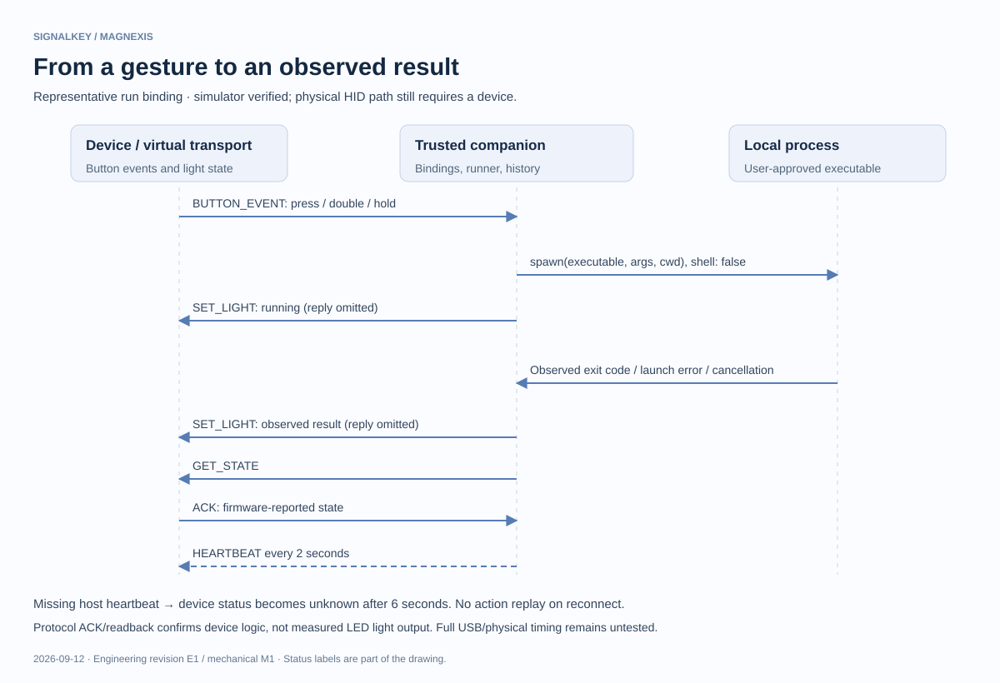
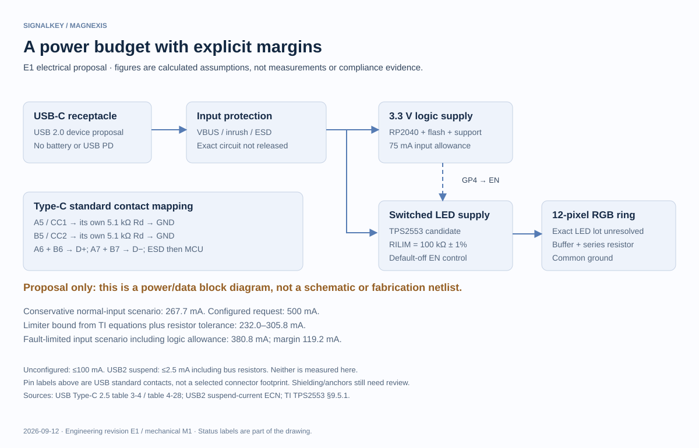
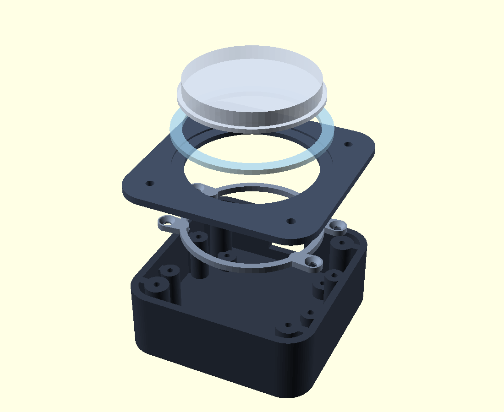
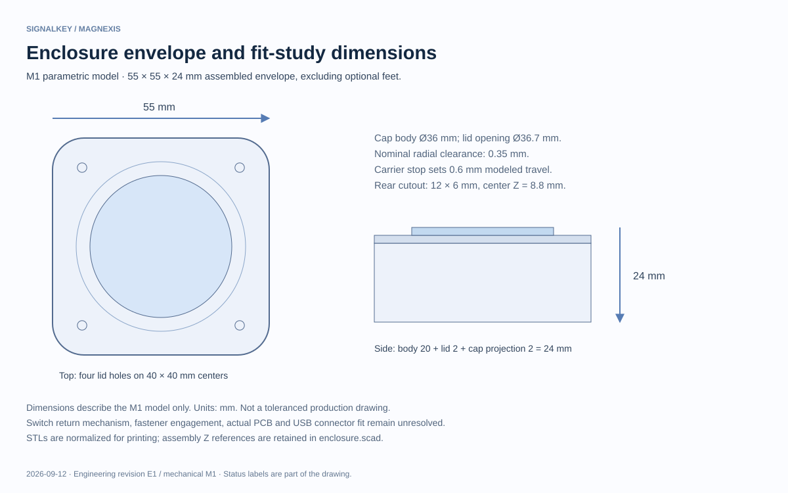
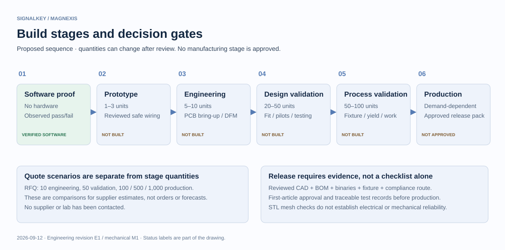

# Historical engineering guide — M1/E1 study

> **Superseded for active enclosure work.** This guide records the M1/E1 study and its source review. Use the [documentation index](README.md), [TILE T1 package](../mechanical/tile-t1/README.md) and [readiness report](READINESS-INTEGRATION.md) for current SignalKey instructions. Do not combine M1 dimensions, E1 assumptions or illustrations below with T1 production or prototype instructions.

Revision: companion 0.1.0-alpha.2 · electrical E1 · mechanical M1 · factory test FT1. Electrical/mechanical source review 2026-09-12; firmware/build plan updated 2026-09-13.

SignalKey connects a physical gesture to an observed local command result. The Windows companion is usable with its simulator. The electronics and enclosure are engineering proposals; no physical unit has been built or certified. This guide is a review package, not authorization to manufacture.

## What the software proves

A configured gesture chooses a reviewed workflow or cancellation. The companion starts a real process without shell interpolation, captures bounded output, and derives its result from the observed process outcome. A light acknowledgement and state readback report device logic; they cannot prove emitted light, current, or user perception. The simulator exercises the same binary contract. History retains the last 100 run metadata records locally, while full output is session-only. Launch timing measures entry into the runner through the process spawn event; it excludes physical USB travel and gesture recognition.

Single press waits for the double-press window. Firmware uses 20 ms debounce, a second debounced down within 300 ms of first debounced up, and an 800 ms hold. A held second press consumes the first. Native C tests check these rules and timer wrap. The host sends heartbeats every two seconds; firmware expires host status at six seconds. OS scheduling and USB delivery still need measurement. A disconnected or stale device must not continue asserting a fresh success.

## Electrical proposal and source traceability

The custom board is a USB 2.0 device with a USB-C data receptacle and no PD. The Pico H prototype uses Micro-USB and a separate carrier. They are distinct mechanical/electrical builds. Connector standard contact names must be translated into the selected manufacturer's footprint numbers and independently checked.

| Decision | Primary source and inspected location | Status |
|---|---|---|
| Separate CC1/CC2 Rd, nominal 5.1 kohm | [USB Type-C 2.5 bundle](https://www.usb.org/sites/default/files/USB%20Type-C%202.5%20Release%20202603.zip), table 4-28, printed p245 | Specification reviewed; 1% parts proposed; circuit absent |
| A5/B5 CC, A6/B6 D+, A7/B7 D− | Same specification, table 3-4, p76 | Standard contact mapping only; actual receptacle unselected |
| Default USB current uses host-managed base USB policy | Same specification, section 2.3.4, p40 | No implementation of 1.5 A/3 A advertisement detection |
| 100 mA before configuration; 500 mA configured USB2 high-power request | [USB 2.0 bundle](https://www.usb.org/sites/default/files/usb_20_20250603.zip), base section 7.2.1 | Descriptor source updated; hardware unmeasured |
| Suspend limit 2.5 mA including bus resistors, averaged over any one-second interval | Same USB2 bundle, Suspend Current Limit Changes ECN | Whole-device low-power implementation and measurement pending |
| Pico header pins and board outline | [Pico datasheet](https://datasheets.raspberrypi.com/pico/pico-datasheet.pdf) | GP2/GP3/GP4 = header 4/5/6; not RP2040 QFN pin numbers |
| 3.3 V GPIO to 5 V LED data candidate | [SN74AHCT1G125 datasheet](https://www.ti.com/lit/ds/symlink/sn74ahct1g125.pdf), recommended supply and electrical characteristics | 4.5–5.5 V supply and 2 V minimum VIH; exact package wiring review pending |
| TPS2553 current-limit calculation | [TPS2553 datasheet](https://www.ti.com/lit/ds/symlink/tps2553.pdf), section 9.5.1, equation 1, p15 | 100 kohm ±1% candidate; no bench validation |

These are selected design-relevant clauses, not a complete compliance review. Use the applicable full specification and ECNs when releasing a design. The source-document hashes in `evidence/source-documents.json` identify locally reviewed documents; third-party source PDFs are not distributed in this repository.

The conservative LED scenario assumes 60 mA per pixel at unrestricted white, a channel ceiling of 64/255, 12 mA total LED quiescent allowance, and 75 mA logic input allowance. None are measurements of a selected production LED lot. Dynamic LED current is 12 × 60 × 64 / 255 = 180.7 mA; normal total input allowance is 267.7 mA.

For resistance R in kohm, TI gives maximum current 22980/R^0.94 and minimum 25230/R^1.016, in mA. Using 99 kohm for maximum and 101 kohm for minimum accounts for 1% resistor tolerance: 232.0–305.8 mA LED-rail limits. The estimated 192.7 mA LED load has 39.3 mA margin below the minimum limit. Adding the 75 mA logic allowance to the maximum limit yields 380.8 mA, leaving 119.2 mA against the configured 500 mA request. Startup, capacitor charging, protection losses, temperature and dynamic response require separate review; a steady-state estimate is not a USB transient limit or proof of protection.

`hardware/power-assumptions.json` is the input; `node scripts/power-budget.mjs` regenerates calculated values. Firmware's GP4 rail gate turns off when unconfigured or suspended and suppresses PIO output while off. This source now passes a pinned ARM compile/link check but has not been bench-tested, and it does not establish that the MCU meets suspend current.

## Mechanical fit study

The model contains base, lid, cap, diffuser and a load-bearing carrier. All five exported meshes have positive volume, consistent winding and closed surfaces; declared bounding dimensions match within 0.02 mm. Sampled cap positions show no volumetric overlap in the modeled solids; coincident stop/contact faces remain. These checks cannot establish strength, printability on every process, reliable return, fastener engagement or fit around unselected components.

The assembled envelope is 55 × 55 × 24 mm excluding feet. Body height 20 mm plus lid 2 mm plus cap projection 2 mm determines that height. Nominal cap radial clearance is 0.35 mm and modeled travel 0.6 mm. These are prototype choices, not production tolerances. The Pico H breadboard build is not claimed to fit this envelope. Native source and five STL exports are in `mechanical`; no STEP or toleranced production drawing is included.

## Manufacturing sequence

The next physical step is a reviewed, preassembled 1–3-unit bench prototype, followed by measured electrical and mechanical feedback. This avoids assuming the custom PCB and enclosure are ready. No material, switch, connector or LED substitution may bypass drawing, power and fit review. Stage quantities are planning ranges, not statistical reliability demonstrations or purchase commitments.

Before an engineering PCB order: select exact parts, create and review schematic/footprints, implement and verify USB power behavior, route the board, resolve ERC/DRC, obtain DFM review, and approve revision-controlled outputs. Before enclosure assembly: print fit coupons, define real switch support/return, check component and plug envelopes, and verify thread engagement and travel against drawings. Before production: validate fixture measurement uncertainty, first article, work instructions, traceability, rework handling, qualified supplier substitutions and the applicable compliance route.

Use `manufacturing/RELEASE-MANIFEST.md` as the handoff gate, `FACTORY-TEST.md` for the draft station sequence, and `validation-matrix.csv` for proposed sample tests. RFQ quantities and cost scenarios are separate from build-stage quantities. Costs remain unknown until actual quotations; no quoted unit price, yield, lifetime, certification or ship date is asserted.

## Build-readiness update — 2026-09-13

Firmware 0.0.3 compiles and links against the real Pico SDK 2.2.0 and its pinned TinyUSB commit. The PIO assembler exposed a reserved-label error, now fixed. Project C files compile with `-Wall -Wextra -Werror`; the SDK is built with its own settings. Native tests now include a session release gate: stale/offline input is discarded, and a button held through reconnect must be released before a new gesture. The host timing loop also samples time after USB callbacks to avoid unsigned heartbeat underflow.

The link-check artifact uses invalid USB identifiers 0:0 and is not for flashing; no application UF2 is generated. See [firmware instructions](../firmware/README.md) and [recorded ARM evidence](evidence/arm-firmware-build.json). Current text/data/bss are recorded by `arm-none-eabi-size`; they do not measure worst-case runtime stack or heap.

[P2 bench commissioning](../hardware/prototype/BUILD-P2.md) uses a Pico H and an off-the-shelf arcade switch, with the LED harness added after button/USB verification. The selected switch requires 38.1 mm depth, so it cannot fit M1. A separate carrier is deliberate, and a later compact design needs a different switch and actual tolerance stack.
