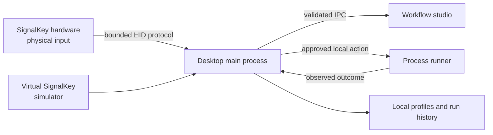

# Buyer evaluation — SignalKey

## Goal

In 15–45 minutes, verify the Product builds or runs as documented and that proprietary notices are present.

## Steps

1. Confirm root `LICENSE` is proprietary and `ACQUISITION.md` exists.
2. Skim `README.md` install/run claims.
3. Execute:

```
```powershell
npm ci
npm run build
npm start
```
```powershell
npm run typecheck
npm test
npm run build
npm run test:desktop
```
```powershell
npm run cli -- devices
npm run cli -- status
npm run cli -- run sample-pass
npm run cli -- light success
npm run demo:sdk
```

```

4. Run tests if present (`npm test`, `pytest`, `cargo test`, `go test ./...`, etc.).
5. Record README vs observed behavior gaps in workpapers.

## Pass criteria

- [ ] Clone succeeds
- [ ] Documented happy path works **or** failure is explained
- [ ] Minimal path needs no surprise secrets
- [ ] License notices intact

*Updated: 2026-09-22*
